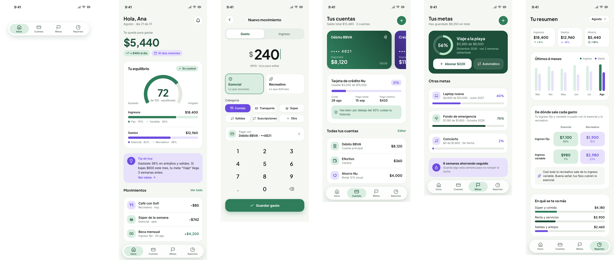

# Equilibrio — Propuesta de aplicación móvil

**Equipo:**
- Diego Hermilo Guillén García — AL07018240
- Santiago Gutiérrez Rivera — AL03094306
- Christopher Eduardo Soto Betancourt — AL07098518
- Abraham Radahi Bautista Triana — AL07124721
**Materia:** Desarrollo de Aplicaciones Móviles
**Fecha:** 31 de agosto de 2026

Gestión y aprendizaje financiero para jóvenes que ganan de forma fija y variable, y necesitan entender —en el momento, no después— si su forma de gastar es sostenible.

## Contenido

01. Descripción del proyecto
02. Problema que resuelve
03. Usuario objetivo
04. Diferenciador
05. Identidad de marca
06. Alcance del proyecto
07. Requerimientos funcionales
08. Requerimientos no funcionales
09. Modelo de negocio
10. Riesgos y mitigación
11. Mockups

---

## 01 · Descripción del proyecto

Equilibrio es una aplicación móvil de finanzas personales cuyo núcleo no es el registro de movimientos, sino el cruce entre dos clasificaciones que ninguna herramienta accesible combina hoy.

Cada ingreso que la persona registra se clasifica como **fijo** o **variable**; cada gasto, como **esencial** o **recreativo**. La aplicación cruza ambas clasificaciones en un **indicador de equilibrio financiero** que resume, en un solo número, qué tan sano es el balance entre cómo entra el dinero y cómo sale. A partir de ese indicador se generan consejos contextuales inmediatos y reportes concisos que señalan puntos de mejora concretos, no genéricos.

El sistema se completa con la gestión de varias cuentas bancarias y tarjetas de crédito, y con metas de ahorro que muestran su avance en el tiempo. Todo pensado para un dispositivo móvil: captura rápida, consulta breve, uso frecuente.

## 02 · Problema que resuelve

Las herramientas de finanzas personales de uso general registran ingresos y gastos como una lista plana de movimientos. Muestran cuánto entró y cuánto salió, pero no relacionan de dónde viene el dinero con en qué se va. Un ingreso variable financiando gasto recreativo no es la misma situación financiera que un ingreso fijo cubriendo gasto esencial, y sin embargo ambas aparecen igual en un historial convencional.

El resultado es que la señal de riesgo llega tarde: la persona nota el desequilibrio cuando ya comprometió el mes, no cuando todavía podía corregirlo. Para alguien sin experiencia financiera previa, la falta de una lectura inmediata y comprensible es, en sí misma, la barrera de entrada a manejar bien su dinero.

## 03 · Usuario objetivo

El usuario principal es una persona joven —estudiante o profesional en inicio de carrera— sin experiencia previa administrando sus finanzas, que típicamente combina un ingreso fijo (mesada, sueldo, beca) con ingresos variables (trabajos independientes, propinas, ventas ocasionales). Busca una herramienta que no exija vocabulario financiero previo ni configuración compleja, y que le enseñe con el uso, no con un curso aparte.

## 04 · Diferenciador

El valor de Equilibrio no está en la cantidad de funciones sino en el cruce que ninguna aplicación accesible ofrece: **tipo de ingreso × tipo de gasto**, resuelto en un indicador único y acompañado de un consejo en el instante del registro. Herramientas como Mint, Fintonic o YNAB acumulan historial; Equilibrio lo interpreta en el momento en que ocurre.

> La educación ocurre dentro del flujo de uso, no en un módulo separado de lecciones. El aprendizaje financiero se entrega como retroalimentación contextual: cada registro de gasto puede generar un tip específico a esa transacción, no una lección genérica programada.

## 05 · Identidad de marca

La identidad busca proyectar calma y control del día a día: interfaz minimalista y limpia, sin ornamento innecesario, que reduzca la ansiedad habitual de hablar de dinero. La paleta distingue visualmente los dos ejes del sistema —verde para ingreso y gasto esencial, morado para gasto recreativo y crédito— de modo que el color mismo comunique la clasificación antes que el texto.

| Color | Uso |
|---|---|
| `#2F7D5B` | Verde — ingreso y gasto esencial |
| `#1D4F3A` | Verde profundo |
| `#6C4CE0` | Morado — gasto recreativo y crédito |
| `#F5F7F3` | Fondo |

Tipografía Plus Jakarta Sans para cifras y títulos, Inter para cuerpo de texto; tarjetas blancas de radio amplio (20–24px) y una barra de navegación capsular flotante refuerzan la sensación de ligereza sobre la pantalla.

## 06 · Alcance del proyecto

El entregable del semestre delimita un sistema completo pero acotado, dejando explícitamente fuera las funciones que exigen mayor esfuerzo de integración o infraestructura.

**Dentro del entregable:** registro y autenticación de usuario, alta de ingresos y gastos clasificados, gestión de cuentas y tarjetas, indicador de equilibrio financiero, reportes concisos, tips contextuales, metas de ahorro, alertas.

**Trabajo futuro:** mascota de la aplicación como alertas ilustradas (plan gratuito) y como asistente conversacional (plan Pro), reportes históricos comparativos extensos, multi-moneda, conexión bancaria automática.

## 07 · Requerimientos funcionales

| Código | Requerimiento |
|---|---|
| RF01 | El sistema debe permitir registrar y autenticar usuarios. |
| RF02 | El sistema debe permitir registrar un ingreso con monto, tipo (fijo/variable), fecha y cuenta destino. |
| RF03 | El sistema debe permitir registrar un gasto con monto, categoría (esencial/recreativo), fecha, cuenta o tarjeta de origen y comprobante opcional. |
| RF04 | El sistema debe permitir dar de alta, editar y consultar el saldo de múltiples cuentas bancarias y tarjetas de crédito. |
| RF05 | El sistema debe calcular y mostrar el indicador de equilibrio financiero cruzando tipo de ingreso y tipo de gasto. |
| RF06 | El sistema debe presentar un panel de reportes con distribución de gasto por categoría y tendencia en el tiempo. |
| RF07 | El sistema debe generar tips contextuales basados en reglas sobre el comportamiento financiero registrado. |
| RF08 | El sistema debe permitir crear metas de ahorro con monto objetivo y plazo, y mostrar su avance. |
| RF09 | El sistema debe emitir alertas cuando el indicador de equilibrio se desvía, una meta está en riesgo o una tarjeta está por vencer. |
| RF10 | El sistema debe limitar, en el plan gratuito, el número combinado de cuentas bancarias y tarjetas de crédito registrables. |

## 08 · Requerimientos no funcionales

| Código | Requerimiento |
|---|---|
| RNF01 | Seguridad: los datos financieros se cifran en tránsito (TLS) y en reposo; las contraseñas se almacenan con hash. |
| RNF02 | Usabilidad: el registro de un gasto o ingreso se completa en pocos toques, con interfaz pensada para móvil. |
| RNF03 | Rendimiento: el indicador de equilibrio y los reportes responden en tiempo casi real con datos locales. |
| RNF04 | Disponibilidad: la aplicación permite registrar movimientos sin conexión y sincronizarlos al recuperarla. |
| RNF05 | Privacidad: el usuario puede borrar su cuenta y sus datos desde la aplicación. |
| RNF06 | Mantenibilidad: arquitectura organizada por capas de datos, lógica de negocio y presentación. |
| RNF07 | Compatibilidad: desarrollo en Android nativo con Kotlin; versión mínima de SDK a definir en implementación. |
| RNF08 | Identidad visual: interfaz minimalista y limpia, paleta verde-morado, que proyecte calma y control del día a día. |

## 09 · Modelo de negocio — Freemium

Equilibrio se monetiza bajo un esquema freemium. El nivel gratuito funciona como canal de adquisición —no como producto sacrificado— y el corte está calibrado por complejidad financiera real, no por uso arbitrario.

| Función | Gratis | Pro |
|---|---|---|
| Cuentas y tarjetas (tope combinado) | Hasta 2 elementos | Ilimitadas |
| Metas de ahorro | 1 activa | Ilimitadas |
| Indicador de equilibrio financiero | Sí | Sí |
| Reportes | Periodo actual | Con histórico |
| Tips contextuales | Básicos | Avanzados y personalizados |
| Exportación de reportes | No | PDF y Excel |
| Publicidad | Sí | No |
| Mascota (trabajo futuro) | Alertas ilustradas | Asistente conversacional |

El tope combinado de cuentas y tarjetas está diseñado para que un usuario con vida financiera simple —una cuenta, una tarjeta— opere cómodo en el nivel gratuito, mientras que quien maneja varias cuentas y tarjetas, perfil con mayor capacidad de pago, alcanza el límite con rapidez. El indicador de equilibrio se mantiene deliberadamente gratuito por ser el diferenciador del producto: restringirlo impediría que el usuario descubra el valor central antes de decidir pagar por él.

## 10 · Riesgos y mitigación

| Riesgo | Mitigación |
|---|---|
| Competencia consolidada (Mint, Fintonic, YNAB) | La propuesta no compite en cantidad de funciones, sino en el indicador cruzado, ausente en esas plataformas. |
| Baja conversión al plan Pro | El nivel gratuito se diseñó como canal de adquisición, no como producto sacrificado. |
| Alcance excesivo para el plazo del semestre | Delimitación explícita del entregable y registro formal de funciones diferidas (sección 06). |
| Sensibilidad del dato financiero | Cifrado en tránsito y reposo, y borrado de datos a pedido del usuario, incorporados desde el diseño (RNF01, RNF05). |

## 11 · Mockups

Cinco pantallas cubren el ciclo completo de uso: entender la situación actual, registrar un movimiento, administrar cuentas y tarjetas, dar seguimiento a metas, y leer el comportamiento financiero en retrospectiva.

1. **Inicio** — saldo disponible, indicador de equilibrio con desglose de ingreso fijo/variable y gasto esencial/recreativo, tip contextual del día y movimientos recientes.
2. **Registro rápido** — alterna entre gasto e ingreso; el cruce esencial/recreativo se captura en el mismo instante del registro, no después.
3. **Cuentas y tarjetas** — carrusel de cuentas y tarjetas, uso de línea de crédito y alertas de fecha de corte y pago mínimo.
4. **Metas** — meta destacada con anillo de avance y abono rápido; metas secundarias y racha de ahorro.
5. **Reportes** — resumen de ingresos, gastos y ahorro con variación; tendencia de seis meses y matriz del cruce ingreso × gasto en lenguaje simple.

*Fig. 1 — Flujo completo de pantallas, generado con pen.dev a partir de la identidad definida en la sección 05.*

---

*Equilibrio — propuesta de aplicación móvil · Desarrollo de Aplicaciones Móviles · Agosto 2026*
